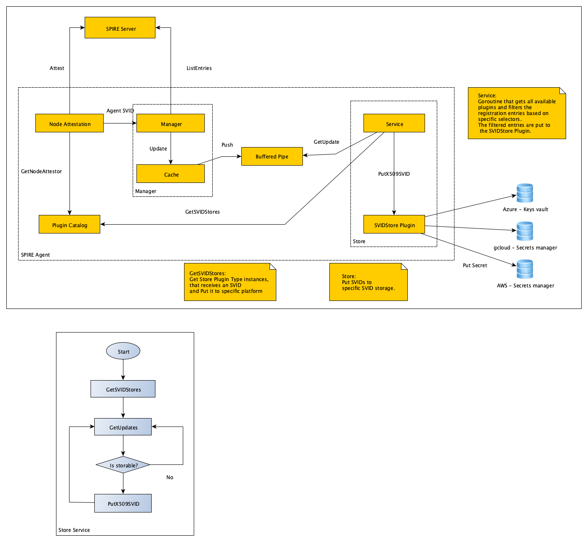

# lambda-poc

This is a proof of concept to demonstrate how serverless computing can be supported in SPIRE through the introduction of an `SVIDStore` agent plugin.

The model leverages the use of secret management services offered by cloud providers to store and retrieve the SVIDs and keys in a secure way, inside the cloud infrastructure.

The serverless functions are registered in SPIRE in the same way that regular workloads are registered through registration entries. The `svidstore` key is used to distinguish the "storable" entries, and `SVIDStore` plugins receives updates of those entries only, which indicates that the issued SVID and key must be securely stored in a location accessible by the serverless function, like AWS Secrets Manager. This way, selectors provide a flexible way to describe the attributes needed to store the corresponding issued SVID and key, like the type of store, name to provide to the secret, and any specific attribute needed by the specific service used.

## Components

### AWS Lambda Extension

Simple extension that reads a secret from AWS Secrets Manager.

*NOTE: it is expected that the secret is a binary `workload.X509SVIDResponse` message.*

The secret name or ARN must be provided using the environment variable "SECRET_NAME" in the function. 
The secret is parsed and the X509-SVID, bundle and key are persisted in the `/tmp` folder.

### Function

The function itself is a Python function that reads the stored SVID from disk prints it so it can be read from the log and returns it in a JSON response.

## Scripts

* [00-var.sh](./00-vars.sh): Contains all the variables used to run this POC. 'FUNCTION_ROLE' must be updated with a valid execution role, ensuring that is has access to AWS Secrets Manager.
* [01-build.sh](./01-build.sh): Build extension and function.
* [02-publish-layer.sh](./02-publish-layer.sh): Publish a new version of the extension.
* [03-create-function](./03-create-function.sh): Create the AWS Lambda function in the configured AWS region.
* [04-run.sh](./04-run.sh): Invoke the AWS Lambda function.
* [05-cleanup.sh](./05-cleanup.sh): Cleanup the AWS resources associated with this project (function, layers, logs).
Util scripts
* [describe-secret.sh](./describe-secret.sh): Describe the stored secret.
* [get-logs.sh](./get-logs.sh): Tail the last hour logs.
* [update-function](./update-function.sh): Update the already created AWS Lambda function, if exists.

## SPIRE changes

The SPIRE Agent cache manager was updated to be able to identify "storable" entries and notify the corresponding plugin when the entries are updated. A new `SVIDStore` agent plugin is introduced for this.



### Entry example

```
Entry ID         : 03be8f19-e6d0-4fc1-9457-fde3c01b6430
SPIFFE ID        : spiffe://example.org/dbuser
Parent ID        : spiffe://example.org/agent
Revision         : 0
TTL              : default
Selector         : svidstore:secretname:svid-dbuser
Selector         : svidstore:type:aws_secretsmanager
```

* `svidstore` is the key used to indicate that the issued SVID and key must be stored in a secure store.
* `svidstore:type:aws_secretsmanager` indicates that the entry must be stored in a store of type `aws_secretsmanager`.
* `svidstore:secretname:svid-dbuser` is an example of how a platform-specific attribute can be specified. In this case, since AWS Lambda needs a secret name or ARN, this selector specifies that the `svid-dbuser` name must be used when storing the secret.
